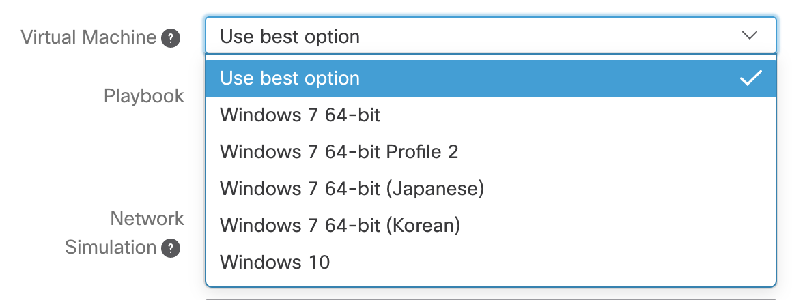
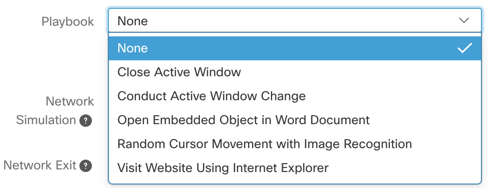
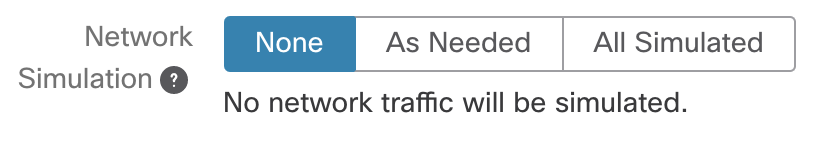
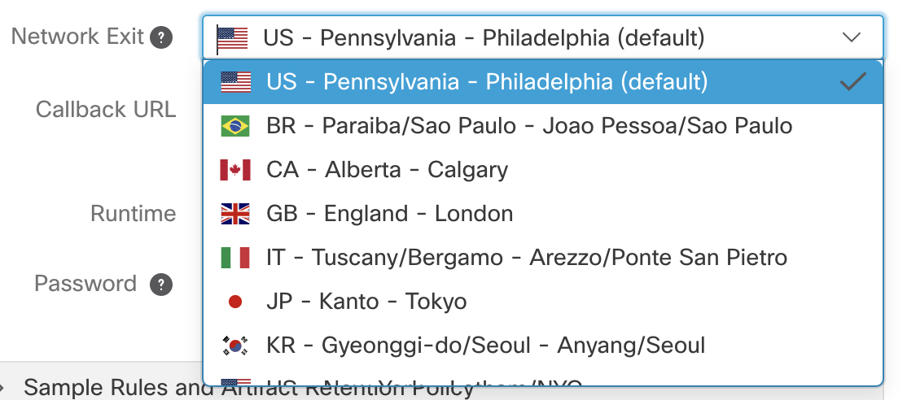

.. _Submitting Samples:
Submitting Samples
==================
Samples (that are supported file types) can be submitted to Threat Grid either automatically or manually for analysis.

.. NOTE::

    It is best practice to query a sha256 hash of your submission prior to submitting a sample to discover if it's
    already been analyzed. :ref:`Querying for an Observable`. This will save time and stop the reanalyzing of the same file multiple times.

Requirements
------------
There are seven minimum required features for an integration with Threat Grid:

1. Ability to enter an API key

.. NOTE::

    To receive an API key go to the Threat Grid dashboard and click your username in the top right corner.
    Then click `My Account` and then `Generate API Key`.

2. Ability to change the URI to allow for regional and `appliance operability <https://www.cisco.com/c/en/us/support/security/amp-threat-grid-appliances/products-installation-guides-list.html>`_

    - Use https://panacea.threatgrid.com/cloud.json to get a list of current regional clouds

3. Link back to the sample in the Threat Grid portal
4. Display the Threat Score for the sample
5. Render at a minimum the Behavioral Indicator count from the sample
6. Allow user to enter tags
7. Allow users to select privacy
8. Allow users to select VM

    - Use the `/api/v3/configuration/vms <https://panacea.threatgrid.com/mask/api-doc/api/v3/configuration/vms>`_ to get a list of options to present to the user

9. Allow user to select playbook

    - Use the `/api/v3/configuration/playbooks <https://panacea.threatgrid.com/mask/api-doc/api/v3/configuration/playbooks>`_ to get a list of options to present to the user

10. Allow user to select network simulation

    - Use the `/api/v3/configuration/network-exits <https://panacea.threatgrid.com/mask/api-doc/api/v3/configuration/network-exits>`_ to get a list of options to present to the user
    - Use the network exits where the `simulation` is not `"none"` (eg. As Needed or All Simulated)

11. Allow user to select network exit

    -  Use the `/api/v3/configuration/network-exits <https://panacea.threatgrid.com/mask/api-doc/api/v3/configuration/network-exits>`_ to get a list of options to present to the user

12. Allow user to enter a password for password protected documents and archive submissions
13. Allow users to enable classification using the `classify` parameter

.. NOTE::

    There are seven additional features that make for a more thorough integration with an improved workflow and user experience:

    1. :ref:`Glovebox Interaction`
    2. Render / Parse full anlysis.json results
    3. Provide easily saved / copied list of IPs, Domains, Hashes, etc...
    4. Download artifacts, video, pcap
    5. :ref:`Pull and display Rate-Limit information`
    6. Allow users to limit the number of daily submissions either by hard limit or % of rate limit
    7. Allow users to choose which file types are submitted

Automated Submission Requirements
^^^^^^^^^^^^^^^^^^^^^^^^^^^^^^^^^

1. Limit submissions to appropriate supported file types

    - Even though html and js files are supported, it often doesn't make sense for a system to automatically submit every html or js file it sees
2. Check if a file has been submitted in the organization within a configurable time window no less than 15 minutes and do not resubmit if it has

Automated Submission Requirements for Archives
""""""""""""""""""""""""""""""""""""""""""""""
1. Extract the contents of the archive and submit the appropriate supported file types individually

Common API Endpoint Examples
----------------------------

.. NOTE::

    To view the complete and up to date Threat Grid documentation and release notes head to the help page in the Threat Grid portal `here <https://panacea.threatgrid.com/mask/doc>`_.

Submitting a File
^^^^^^^^^^^^^^^^^

.. http:example::

    POST https://panacea.threatgrid.com/api/v2/samples&api_key=12345abcde HTTP/1.1

.. http:example::

    POST /api/v2/samples?api_key=12345abcde HTTP/1.1
    Content-Type: application/x-www-form-urlencoded
    Host: panacea.threatgrid.com
    Content-Disposition: form-data; name="sample"; filename="test_file.txt"
    Content-Disposition: form-data; name="network_exit"
    Content-Disposition: form-data; name="private"
    Content-Disposition: form-data; name="vm"

.. code-block:: bash

    curl -XPOST -F "sample=@readme.doc" -F api_key=MY_API_KEY
    https://panacea.threatgrid.com/api/v2/samples

Example response:

.. code-block:: JSON

    {
      "api_version": 2,
      "id": 5760911,
      "data": {
        "tags": [
          ""
        ],
        "md5": "8f3a3bc8c6ff1a9ebf39e29e31054ddb",
        "private": true,
        "analyzing": true,
        "vm": "win10",
        "submission_id": 876379151,
        "state": "wait",
        "login": "jwick",
        "sha1": "3cebd815a45a3014498cfaa6c224071736f22f61",
        "filename": "safe.pdf",
        "status": "pending",
        "submitted_at": "2020-02-05T21:57:37Z",
        "id": "3c9b42a4dc08e2d61074f21e951446b0",
        "sha256": "73661efe4d40c8e1760052717f3df40ef0db74cfdc0b29f3c7f8bfd7c5b8a1ff",
        "os": ""
      }
    }

Check State of a Sample
^^^^^^^^^^^^^^^^^^^^^^^

There are 6 possible results for a sample state:

1. wait
2. prep
3. run
4. proc
5. succ
6. fail

.. http:example::

    GET https://panacea.threatgrid.com/api/v2/samples/$ID/state&api_key=12345abcde HTTP/1.1

Example response:

.. code-block:: JSON

    {
      "api_version": 2,
      "id": 264041,
      "data": {
        "state": "succ"
      }
    }

Check State of Multiple Samples (Recommended)
^^^^^^^^^^^^^^^^^^^^^^^^^^^^^^^^^^^^^^^^^^^^^

There are 6 possible results for a sample state:

1. wait
2. prep
3. run
4. proc
5. succ
6. fail

.. http:example::

    GET https://panacea.threatgrid.com/api/v2/samples/state&api_key=12345abcde HTTP/1.1

Example response:

.. code-block:: JSON

    {
      "api_version": 2,
      "id": 5035068,
      "data": [
        {
          "sample": "060f667866af6cd8a47e0f4846905209",
          "state": "succ",
          "status": "job_done"
        },
        {
          "sample": "3c9b42a4dc08e2d61074f21e951446b0",
          "state": "succ",
          "status": "job_done"
        },
        {
          "sample": "3e91622a01a8557db849a516d98cc8c4",
          "state": "succ",
          "status": "job_done"
        },
        {
          "sample": "b03537e69f24f0e8cc3cffcda0b04be7",
          "state": "succ",
          "status": "job_done"
        }
      ]
    }

Download Analysis Elements
^^^^^^^^^^^^^^^^^^^^^^^^^^

Runtime Video
"""""""""""""

.. http:example::

    GET https://panacea.threatgrid.com/api/v2/samples/$ID/viedo.webm&api_key=12345abcde HTTP/1.1

Analysis JSON
"""""""""""""

.. http:example::

    GET https://panacea.threatgrid.com/api/v2/samples/$ID/analysis.json&api_key=12345abcde HTTP/1.1

Process Timeline JSON
"""""""""""""""""""""

.. http:example::

    GET https://panacea.threatgrid.com/api/v2/samples/$ID/processes.json&api_key=12345abcde HTTP/1.1

Network PCAP
""""""""""""

.. http:example::

    GET https://panacea.threatgrid.com/api/v2/samples/$ID/network.pcap&api_key=12345abcde HTTP/1.1

.. _Glovebox Interaction:

Get Glovebox URI
^^^^^^^^^^^^^^^^

Via a feature called 'Glovebox' Threat Gird allows users to interact with samples while the VM they are being analyzed
in is running. The URI to the Glovebox environment can be loaded in an iFrame allowing users to interact with samples
from within your UI.

.. NOTE::

    The glovebox_url is only available when the sample state is "run"

For this endpoint the URI is ``.data.glovebox_url``:

.. http:example::

    GET https://panacea.threatgrid.com/api/v2/samples/$ID&api_key=12345abcde HTTP/1.1

For this endpoint the URI is ``.data.items[].glovebox_url``:

.. http:example::

    GET https://panacea.threatgrid.com/api/v2/samples?id=$ID&api_key=12345abcde HTTP/1.1

Example:

.. code-block:: JSON

    {
      "api_version": 2,
      "id": 8681325,
      "data": {
        "tags": [],
        "md5": "d60afc39d34d9e5bf49f679b2ad35778",
        "glovebox_url": "https://glovebox.rcn.threatgrid.com/glovebox/bKzIvrpFRSS0hCtizvo6tgGQoe_8y9EdYzBiGvBEN7iYHFvsoGi8vKRSUJVBw2e2/",
        "started_at": "2020-10-16T12:22:20Z",
        "vm": "win7-x64",
        "submission_id": 1025369450,
        "state": "run",
        "login": "jwick",
        "sha1": "6ec891d45ea89a443fc1809b9c7655b204305e2d",
        "filename": "d60afc39d34d9e5bf49f679b2ad35778",
        "status": "analyzing_sample",
        "submitted_at": "2020-10-16T12:22:20Z",
        "id": "981c5beca068bcbca452509541c367b6",
        "sha256": "125273cbe4b01ecb380573766dd83791f66d0a6e85f2e6ab99a62e40c83e7542"
      }
    }

.. _Pull and display Rate-Limit information:

Rate Limit Information
----------------------

Threat Grid organizations have a limited number of submissions per 24 hour period. It may be useful to fetch this
information and render it in the UI so user can easily see how much of their limit remains. Doing this requires the
use of two API calls.

First:

Get the login associated with the API key using `/api/v3/session/whoami <https://panacea.threatgrid.com/mask/api-doc/api/v3/session/whoamii>`_

.. http:example::

    GET https://panacea.threatgrid.com/api/v3/session/whoami&api_key=12345abcde HTTP/1.1

.. code-block:: JSON

    {
        "api_version":3
        "data":{
            "title":"Widget Wrangler"
            "login":"JohnnyMac"
            "name":"John McCarthy"
            "organization_id":8
            "email":"jmccarthy@threatgrid.com"
            "role":"user"
        }
    }

Store the value found at ``data.login`` and use it in the second API call.

Second:

Query the Rate Limit using `/api/v3/users/:login/rate-limit <https://panacea.threatgrid.com/mask/api-doc/api/v3/users/:login/rate-limit>`_.
This will return the rate limit for the user and organization. If the value of ``.data.user.submissions-available`` is ``NULL``
it means there is no limit set for the user and the value of organization limit ``.data.organization.submissions-available`` will apply.

.. http:example::

    GET https://panacea.threatgrid.com/api/v3/users/$login/rate-limit&api_key=12345abcde HTTP/1.1

.. code-block:: JSON

    {
      "api_version": 3,
      "id": 9058684,
      "data": {
        "user": {
          "submission-rate-limit": [],
          "submission-wait-seconds": 0,
          "submissions-available": null
        },
        "organization": {
          "submission-rate-limit": [
            {
              "samples": 1000,
              "minutes": 1440,
              "submissions-available": 1000,
              "submission-wait-seconds": 0
            }
          ],
          "submission-wait-seconds": 0,
          "submissions-available": 1000
        }
      }
    }

